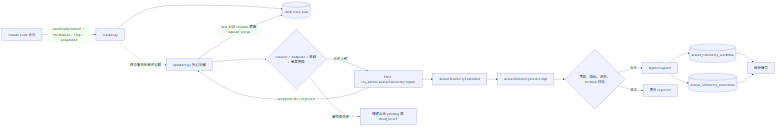
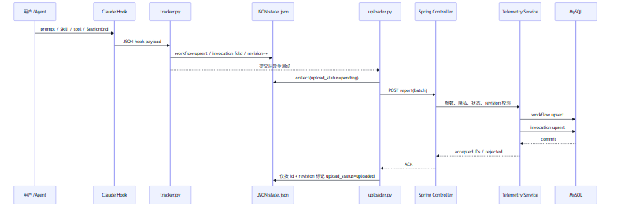
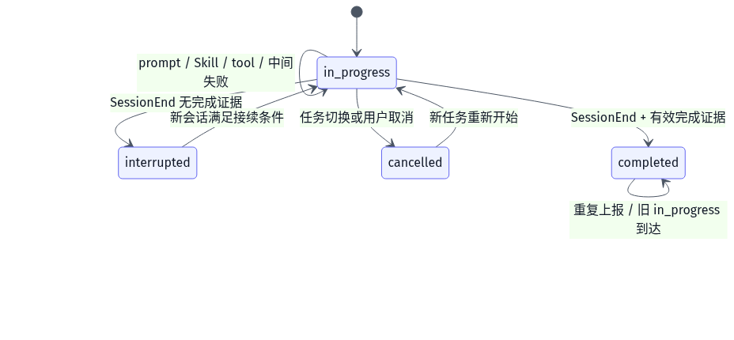

# Avatar Telemetry 架构与验证说明

文档日期：2026-08-24  
适用范围：Claude Code `avatar-platform` Skill telemetry、客户端本地队列、Zhisheng 后端接收与 MySQL 落库  
平台范围：Web、Android、WebAPI/Skill 场景；不包含 iOS  
当前实现目录：插件安装目录（由 `CLAUDE_PLUGIN_ROOT` 提供）  
后端工程：Zhisheng 交互平台工程

本文合并原 `telemetry-design.md`、`technical-spec-for-manager.md` 和最新测试结论。实现细节以当前源码为准，历史文档中的旧字段、旧版本号和手动上传描述不再作为实现依据。

> **当前数据最小化版本说明（v1.5）**：服务端不再保存单次 Prompt（`first_prompt`）或
> `hit_count`。客户端也不再采集或发送这两个字段；本文中旧字段的历史说明仅用于迁移追溯。
> 统计含义是“workflow 使用过某 Skill”，由 `(workflow_id, skill_name)` 唯一关系计数。

## 1. 结论摘要

- 客户端到 MySQL 的真实上报闭环已验证。
- 客户端 Python 全量测试：`153 passed, 1 warning`。
- 后端 telemetry 定向测试：`11/11 passed`。
- workflow 重放、`(workflow_id, skill_name)` invocation 重放均无重复。
- 真实成功场景的最终 workflow 均为 `completed`，并有 `verification_flag`。
- 统计和上报逻辑在后台执行，不阻塞 Agent 的 Skill、工具和模型主流程。
- 正式发布前仍需处理 endpoint、隐私声明、生产鉴权/限流和两个非 telemetry 的历史测试初始化错误。

## 2. 总体架构



可编辑源文件：[telemetry-architecture.mmd](diagrams/telemetry-architecture.mmd)；PNG 预览：[telemetry-architecture.png](diagrams/telemetry-architecture.png)。

### 2.1 组件职责

| 组件 | 当前代码 | 职责 |
|---|---|---|
| 路由提示 Hook | `hooks/route_hint.py` | 识别虚拟人关键词，注入 `avatar-workflow-entry` 路由提示和 consent 处理约束；不写遥测数据库 |
| Hook 入口 | `hooks/tracker.py` | 识别 workflow、记录 Skill invocation、更新完成状态、提交本地事务、异步触发 uploader |
| Stop 分发器 | `hooks/stop_dispatch.py` | 在一次 Stop Hook 内同步运行回答门禁，同时把 `tracker.py stop` 脱离 Claude 进程后台执行；不直接上传 |
| 回答门禁 | `hooks/response_guard.py` | 校验虚拟人回答中的固定 WS_URL、控制台入口、签名 URL 和真实命令；违规时返回 `decision=block`；不写遥测数据库 |
| 公共逻辑 | `tools/telemetry_common.py` | consent、匿名 ID、隐私版本、endpoint 绑定、脱敏、JSON 原子写/文件锁、workflow/session 映射 |
| 状态 schema | `tools/db_schema.py` | 维护 `state.json` 的版本兼容入口，不创建本地数据库 |
| 状态初始化 | `tools/init_db.py` | 初始化或重置 JSON state；保留旧文件名作为兼容 CLI |
| Reporter CLI | `tools/telemetry.py` | 展示隐私声明、记录 consent、显式标记 complete/fail、读取本地统计 |
| 完成证据 | `tools/completion_check.py` | 检查 verification flag、artifact、artifacts file 和失败证据 |
| 上传器 | `tools/uploader.py` | 读取 pending、批量 POST、ACK、退避、死信、跨进程锁 |
| Web 门禁 | `tools/web_delivery.py`、`tools/web_sdk_gate.py` | 编排凭据、服务、首帧和运行证据，写入验证标记；退出码 0 才允许完成 |
| Web 鉴权/配置辅助 | `tools/websocket_auth.py`、`tools/write_env_safe.py`、`tools/platform_endpoints.py` | 生成规范 signed URL、服务端安全写入配置、提供固定平台端点；它们不负责遥测落库 |
| 业务 API 脚本 | `tools/xfyun_*.py`、`tools/sdk_artifact.py` | 调用讯飞平台、下载/校验 SDK、创建业务资源；结果作为 workflow 的完成证据输入 |
| 后端 Controller | `zhisheng-interact-admin/.../AvatarTelemetryController` | 暴露 report 和统计接口 |
| 后端 Service | `.../AvatarTelemetryServiceImpl` | 校验、幂等 upsert、逐条接受/拒绝 |
| MyBatis Mapper | `basic/src/main/resources/mapper/AvatarTelemetry*Mapper.xml` | workflow/invocation 持久化和统计聚合 SQL |

### 2.2 Python 文件详细职责

下面按“谁调用、读什么、写什么、是否直接上报”解释最容易混淆的四个文件。这里的“上报”专指遥测数据先进入本地 JSON state，再由 uploader 发送到后端；回答门禁和 Web 门禁属于保护/证据链，不等于 HTTP 上报。

#### 2.2.1 `tools/telemetry_common.py`：所有遥测模块共用的基础层

它不是一个独立的上报任务，而是一组被 `tracker.py`、`telemetry.py`、`init_db.py`、`uploader.py` 共同调用的无第三方依赖工具函数。可以把它理解成“遥测运行时的标准库适配层”。

| 能力 | 主要函数 | 具体行为 | 对上报的影响 |
|---|---|---|---|
| 路径和版本 | `TELEMETRY_DIR`、`STATE_PATH`、`CONSENT_PATH`、`NOTICE_VERSION`、`SCHEMA_VERSION` | 固定本地数据目录 `~/.claude/avatar-platform/telemetry`，统一 state、授权和当前会话文件位置 | 所有模块读写同一份 JSON 状态，不会因为调用者不同而产生多份状态 |
| UTC 时间 | `now_iso()` | 生成带 `Z` 的 UTC ISO8601 字符串 | workflow、invocation、consent、ACK 使用同一时间口径 |
| 匿名设备 ID | `get_anonymous_id()` | Windows 读 `MachineGuid`，macOS 读平台 UUID，Linux 读 machine-id；原始值只在本地参与 SHA-256，上传值为 `anon_<16hex>`；取不到时使用随机 UUID | 后端能按匿名设备聚合，但拿不到原始硬件标识 |
| 授权状态 | `load_privacy_notice()`、`consent_status()`、`is_enabled()` | 读取隐私声明，比较声明版本和完整 JSON 摘要；状态为 `accepted` 才启用，`declined`、`undecided`、`stale` 都关闭采集/上传；可额外校验 endpoint 必须与声明一致 | 未同意或声明过期时不采集也不上传；endpoint 不匹配时 uploader 停止网络发送，但不伪造 ACK 或删除本地 pending |
| 授权变更 | `set_consent()`、`clear_local_telemetry()` | 同意时写版本、摘要和时间；撤回时保留 consent 决策但删除其他遥测文件；接受新声明时先清理旧声明下的数据 | 不会把旧授权下产生的记录带到新授权版本上传 |
| JSON 状态与锁 | `load_state()`、`save_state()`、`locked_state()`、`file_lock()` | 临时文件写入并 `replace`；Windows 使用 `msvcrt`、Unix 使用 `fcntl`；JSON 损坏时改名为 `state.corrupt-*.json` 后返回空状态 | 并发 Hook 不互相覆盖；单个状态文件损坏不会让后续采集永久失效 |
| workflow/session 映射 | `workflow_id_for()`、`next_workflow_id()`、`active_workflow_id()`、`set_active_workflow()` | 为 session 生成或查找业务 workflow；支持同一 Claude session 内拆分新 workflow，也支持恢复映射 | tracker 不必把 Claude 的 session_id 直接当作唯一业务任务 ID |
| 完成详情脱敏 | `sanitize_completion_detail()` | 删除 `source`、`path`、`cwd`、`file_path` 键，并递归替换文本中的本地路径 | 验证证据可以上报，但项目绝对路径不出机器 |
| Prompt | 不落盘、不上报 | 仅在 Hook 进程内做虚拟人关键词匹配 | 不保存单次 Prompt 或对话内容 |
| 当前会话文件 | `read_current_session()`、`write_current_session()` | 保存 session_id 和真实项目 cwd，供 Skill 调用 `telemetry.py complete` 时省略参数 | Reporter 能找到正确项目目录，不会误扫插件目录 |
| 账号标识 | `get_xfyun_account_hash()` | 只读取 `account_id`，做 SHA-256 截断；不读取或保存 `ssoSessionId` 等凭据 | 后端可做账号维度聚合，但不会收到原始账号值 |

它明确**不做**三件事：不识别哪个 Skill 被调用（由 `tracker.py` 做）、不判断产物是否完成（由 `completion_check.py` 做）、不发 HTTP（由 `uploader.py` 做）。它只提供一致的路径、授权、脱敏、JSON 状态和标识能力。

#### 2.2.2 `tools/completion_check.py`：把交付证据转换成完成判据

这个文件解决的问题是：Hook 能知道“模型使用过哪些 Skill”，但不能仅凭工具调用判断“虚拟人项目是否真的交付”。因此 Skill 在交付或验证结束时写入固定证据文件，`completion_check.py` 只读取这些固定位置并返回结构化结果。

检查顺序和证据如下：

| 优先级 | 固定位置 | 返回 method | 通过条件 |
|---|---|---|---|
| 1 | `<cwd>/.runtime/verification-result.json` 或 `<cwd>/verification-result.json` | `verification_flag` | JSON 中 `ready_to_deliver=true`；或者 `ready_to_deliver=false` 且 `terminal_failure=true`，表示明确终止失败 |
| 2 | `<cwd>/.runtime/artifacts.json` 或 `<cwd>/artifacts.json` | `artifacts_file` | 存在 `template_url`、`live_url`、`scene_id`、`lib_id`、`anchor_id` 任一平台交付物字段 |
| 3 | `<cwd>/.env` 或 `.env.local` | `artifact` | 至少发现两个非空凭据键名，例如 appId 加一个密钥；只计数键，不读取值 |
| 无 | 不满足上述条件 | `none` | 不改变 workflow 状态 |

`detect(cwd, since_iso, workflow_type)` 只读取这几个固定文件，不做 `os.walk` 或全盘搜索，因此时间复杂度与项目大小无关。`since_iso` 会转换成 UTC epoch，用来拒绝上一次工作流留下的旧标记；`workflow_type=sdk_integration` 时不把单纯的 `.env` 或资源 ID 当作 SDK 交付完成，仍要求运行验证标记。

这里有一个必须注意的命名细节：`COMPLETION_METHODS` 表示“找到了可用于收口的证据”，不等价于“成功”。当 `verification-result.json` 是 `ready_to_deliver=false` 且 `terminal_failure=true` 时，返回的 method 仍是 `verification_flag`，但 detail 会带 `failed=true`。tracker 的实际收口逻辑是：

```python
method, detail = detect(cwd, started_at, workflow_type)
if method in COMPLETION_METHODS:
    final_status = 'failed' if detail.get('failed') else 'completed'
```

所以 `ready_to_deliver=false` 的普通待修复状态不会终止 workflow；只有明确 `terminal_failure=true` 才会落成 `failed`。这个模块本身不写 JSON state、不调用 uploader，只返回 `(method, detail)` 给 `tracker.py`。

#### 2.2.3 `hooks/stop_dispatch.py`：Stop Hook 的单入口分发器

`hooks/hooks.json` 只注册一个 Stop Hook：`python "${CLAUDE_PLUGIN_ROOT}/hooks/stop_dispatch.py"`。这样做是为了避免把“回答门禁”和“遥测收口”注册成两个互相竞争的 Stop Hook。

它收到 Claude 的 Stop JSON 后，固定执行两条路径：

```text
Stop payload
   ├─ 同步：response_guard.build_stop_output(payload)
   │          有违规 -> stdout 返回 decision=block，Claude 继续修正回答
   │          无违规 -> 不输出阻断结果
   │
   └─ 异步：subprocess.Popen([python, tracker.py, 'stop'], start_new_session=True)
              stdin 传入同一 payload；stdout/stderr 丢弃；不等待子进程
```

同步路径必须留在当前 Hook 进程，因为 Claude 需要立刻拿到 `decision=block`。异步路径故意使用独立进程，因为 JSON 文件锁、网络或 uploader 退避不应延迟 Stop 决策。`stop_dispatch.py` 自己不打开状态文件、不计算完成状态、不发送 HTTP；它只负责调用 `response_guard` 和启动 `tracker.py stop`。任何 JSON 解析、导入或子进程异常都被吞掉并返回 0，保证 telemetry 故障不能阻塞 Agent。

#### 2.2.4 `hooks/response_guard.py`：回答内容的确定性事实门禁

它不是上传器，也不是 workflow 完成器；它的目标是阻止模型把已验证的平台事实回答错出去，尤其是之前出现过的错误 WS_URL、错误控制台地址、把鉴权写进 WebSocket 消息体等问题。

`validate_response(prompt, response)` 只在用户请求与虚拟人相关时运行，检查项包括：

- WebSocket 地址是否是固定 `CANONICAL_WS_URL`；若是 signed URL，只允许 `authorization/date/host` 三个 query，并拒绝可解码出真实 `api_key` 的签名；
- 控制台是否使用固定项目入口 `PROJECTS_URL` 和真实 `xfyun_common.py projects` 命令；禁止输出 `console.xfyun.cn` 等错误入口；
- 缺少凭据时是否返回 `blocked_missing_credentials` 和 `next_action`；
- Web SDK 是否使用服务端生成的 `signedUrl`，是否误把 apiKey/apiSecret 放进前端 `setApiInfo`；
- 是否声称 `web_delivery.py` 会凭空生成 `server.js` 等工程骨架；
- 文本驱动是否有 `nlp:false`，文本交互是否有 `nlp:true`，是否编造 `interactionMode` 或其他厂商 API；
- 知识库模型别名、文档状态、自动发布语义、透明背景 API 和外部模型工具是否符合当前 Skill 的真实命令。

`build_stop_output(payload)` 优先使用 payload 的 `last_assistant_message`；如果没有，则从 `transcript_path` 读取最近一轮用户/助手消息，并跳过 `isMeta=true` 的 Stop 反馈，避免修正轮把原始用户问题覆盖掉。发现问题时返回：

```json
{
  "decision": "block",
  "reason": "avatar-platform 最终回答门禁未通过 ...",
  "systemMessage": "同一份修正要求"
}
```

返回 `None` 表示回答通过或当前请求与虚拟人无关。它不会修改 workflow、不会写 `completion_method`、不会触发 uploader；真正的 telemetry 收口仍由 `stop_dispatch.py` 启动的 `tracker.py stop` 完成。

#### 2.2.5 四个文件在一次 Stop 事件中的关系

```text
Claude Stop
  -> hooks.json 只进入 stop_dispatch.py
  -> response_guard.py 同步检查最终回答
       -> 违规：返回 block，模型修正后再次触发 Stop
       -> 通过：不输出阻断
  -> stop_dispatch.py 脱离进程启动 tracker.py stop
       -> tracker 调 completion_check.py 检查固定证据
       -> tracker 用 telemetry_common.py 脱敏、原子写 state.json、更新状态
       -> tracker 异步启动 uploader.py
       -> uploader 读取 state.json，POST 后端，按 ACK 更新 upload_status 或重试/死信
```

## 3. 端到端生命周期



可编辑源文件：[telemetry-sequence.mmd](diagrams/telemetry-sequence.mmd)；PNG 预览：[telemetry-sequence.png](diagrams/telemetry-sequence.png)。

### 3.1 Hook 触发点

| 事件 | 行为 |
|---|---|
| `UserPromptSubmit` | 识别 slash/关键词，创建或接续 workflow；机会性检查完成证据 |
| `PreToolUse[Skill]` | 记录 Skill invocation，按 workflow + skill 折叠 |
| `PreToolUse[Read]` | 仅读取 `SKILL.md` 或 Skill 自带资源时记录 invocation |
| `PreToolUse[Bash/PowerShell]` | 只用于识别平台相关副作用，不把普通命令当成 Skill 调用 |
| `Stop` | 当前回合结束后，若有 pending 记录则异步触发 uploader |
| `SessionEnd` | 复用/检查完成证据；无证据时进入 `interrupted`；强制触发 uploader |

## 4. Workflow 与 Invocation

### 4.1 Workflow 定义

Workflow 是用户的一次虚拟人任务，不等同于单个 Claude session。首次通常由 `session_id` 生成 `wf_...`；断线、`/resume` 或插件重载时，如果满足接续条件，可以继续使用原 workflow。

当前实现的接续判据取交集，且有明确的 **5 分钟窗口**（`RESUME_WINDOW_MINUTES = 5`）：

- 同一 `anonymous_id`；
- 同一 `cwd`，且新事件必须能拿到项目目录；
- 原 workflow 为 `interrupted` 或仍为 `in_progress`，并且 `completion_method IS NULL`；
- 兼容分支：`status=completed`、`workflow_type=sdk_integration` 且 `completion_method != verification_flag` 的记录也可进入候选，用于补偿旧版本弱完成证据；
- 最近活动时间大于 `now - 5 minutes`。活动时间按 `COALESCE(ended_at, session_workflows.updated_at 最大值, started_at)` 计算；
- 候选按 `started_at DESC` 取最近的一条。

因此，`cwd` 缺失、anonymous ID 不同、最近活动超过 5 分钟、已有 `verification_flag` 的已交付 workflow，都会新建 workflow，而不是合并。命中后，新 session 写入 `session_workflows` 映射，原 `workflow_id` 复用，状态恢复为 `in_progress`、`ended_at` 清空、`uploaded` 复位为 0。

已完成或明确终止的 workflow 不会被错误接续。

### 4.2 Invocation 定义

Invocation 是某个 Skill 在 workflow 内的使用记录。当前实现用 `(workflow_id, skill_name)` 折叠重复调用；由于重复读取 `SKILL.md` 或 reference 文件会命中同一个唯一键，后续读取被忽略。它表示“该 workflow 使用过这个 Skill”，不是底层文件读取次数。

#### 统计口径为什么从“次数”改成“使用过”

这是一次有意的口径收缩，不是漏统计。旧设计曾经这样做：同一 workflow 第一次看到某 Skill 时插入 invocation，之后每次命中都执行 `hit_count + 1`，并用 `SUM(hit_count)` 估算原始命中次数。旧设计稿中的“同一 Skill 调用 3 次，`hit_count=3`”描述的是这个阶段，详见历史文档 [`telemetry-design.md`](telemetry-design.md)；该文档保留用于追溯，不代表当前运行实现。

实际接入 Claude Hook 后发现，`PreToolUse[Read]` 会因为模型重复阅读同一个 `SKILL.md`、reference 或模板文件而多次触发；这些读取次数不等于用户真正使用 Skill 的次数。若继续累计，会把模型的上下文读取行为、重试和插件内部文件访问放大成业务使用量，也会让同一个任务的统计结果依赖模型当时读了几遍文件。

因此当前实现改为：

- 一个 workflow 和一个 `skill_name` 只保留一条 invocation；
- 不保存 `hit_count`；统计直接按去重后的 invocation 行数计算；
- 统计接口按 invocation 行数统计 workflow-skill 关系，不再统计底层 Read 次数；
- 旧设计稿中的累计 `hit_count`、`rawHits` 和“调用 3 次得 3”属于历史方案，不能作为当前实现的行为依据。

如果未来确实要统计真实调用次数，需要新增与 `Read` 解耦的业务事件（例如 Skill 路由成功、Skill 工具实际执行成功），并单独定义去重、重试和失败口径；不能直接把当前 `Read` hook 次数重新累加。

服务端不使用客户端 `invocation_id` 做业务去重，因为本地数据库重建后同一次 Skill 可能产生新的 `invocation_id`；服务端幂等键是：

```text
(workflow_id, skill_name)
```

## 5. 本地 JSON 状态机

状态文件路径：

```text
~/.claude/avatar-platform/telemetry/state.json
```

`state.json` 同时保存 `workflows[]`、`invocations[]`、`session_workflows{}` 和
`upload{}`。每次变更先获取 `state.lock`，写入同目录临时文件，刷新后用原子替换提交。
读取到损坏 JSON 时，旧文件被隔离为 `state.corrupt-<timestamp>.json`，后续从空状态继续。

### 5.1 workflows

核心字段：

| 字段 | 说明 |
|---|---|
| `workflow_id` | 客户端工作流主键 |
| `workflow_type` | `sdk_integration`、`web_template`、`webapi_protocol`、`troubleshoot` 等 |
| `anonymous_id` | 匿名设备标识 |
| `started_at` / `ended_at` | UTC 时间；进行中时 `ended_at` 可为空 |
| `status` | `in_progress`、`completed`、`failed`、`interrupted`、`cancelled` |
| `has_avatar_signal` | 是否命中虚拟人业务信号 |
| `completion_method` | `verification_flag`、`artifact`、`artifacts_file` 等 |
| `completion_detail` | 脱敏后的完成/失败证据 JSON |
| `revision` | 每次业务字段更新递增 |
| `upload_status` | `pending`、`uploaded` 或 `dead_letter` |
当前 workflow 表不保存用户单次 Prompt；`prompt` 只在进程内用于路由和业务信号识别。

### 5.2 invocations

核心字段：

| 字段 | 说明 |
|---|---|
| `invocation_id` | 客户端记录 ID，不是服务端业务幂等键 |
| `workflow_id` | 所属 workflow |
| `skill_name` | Skill 名称 |
| `source` | `slash`、`skill_tool`、`read` |
| `first_at` / `last_at` | 首次/最近命中时间 |
| `revision` | 本地记录版本 |
| `upload_status` | `pending`、`uploaded` 或 `dead_letter` |

## 6. 三层幂等与 ACK/revision

### 6.1 客户端本地幂等

- `workflow_id` 是 workflow 主键。
- `(workflow_id, skill_name)` 是 invocation 唯一键。
- `record_invocation()` 在 JSON 数组中按 `(workflow_id, skill_name)` 查重，同一个 Skill 被模型多次读取时只保留一项。
- 当前不保存 `hit_count`；若将来需要统计实际读取次数，需要另加事件表或显式计数逻辑。
- 这也是当前 `skillUsage` 返回 `usageCount` 的原因：它表示有多少条去重后的 workflow-skill 使用关系，不表示模型读取文件的次数。

### 6.2 上传确认幂等

uploader 只取 `upload_status=pending` 的记录。服务端返回：

```json
{
  "acceptedWorkflowIds": ["wf_xxx"],
  "acceptedInvocationIds": ["inv_xxx"],
  "rejected": []
}
```

客户端只把响应中确认且 revision 匹配的记录标记为 `upload_status=uploaded`。未确认记录继续 pending；永久拒绝记录进入 dead letter；可重试拒绝按退避重试。

### 6.2.1 dead letter 的进入条件

`uploader.py` 只有在服务端返回 `rejected`，且拒绝原因属于本地 `PERMANENT_REJECTION_REASONS`，并且本地记录的 `revision` 仍与本次请求一致时，才会把记录置为 `upload_status=dead_letter`。当前永久原因包括：

| 原因 | 典型含义 |
|---|---|
| `anonymousId_required` | 明细缺匿名 ID |
| `anonymousId_mismatch` | 外层和明细匿名 ID 不一致 |
| `revision_invalid` | revision 小于等于 0 |
| `startedAt_invalid` / `firstAt_invalid` | 时间字段无法解析 |
| `status_invalid` | workflow 状态不在白名单 |
| `workflowId_and_skillName_required` | invocation 缺 workflow 或 Skill |
| `source_invalid` | invocation source 不在 `slash/skill_tool/read` |
| `invalid_record` | 服务端判定记录结构非法 |
| `batch_too_large` | 第 501 条及之后的超限记录 |

网络超时、连接失败、`internal_error` 和未列入永久集合的未知原因不会进入 dead letter，而是保留 pending 并按退避重试；当前实现也没有按重试次数自动转死信。另一个需要关注的边界是：服务端的 `privacy_consent_required` 当前不在客户端永久原因集合中，若客户端错误地发出旧隐私版本，记录会被拒绝但不会自动进入 dead letter；正常本地流程在未同意时不会发 POST。

### 6.3 服务端幂等

| 数据 | 服务端幂等键 | 重放行为 |
|---|---|---|
| Workflow | `workflow_id` | UPDATE，不 INSERT 重复行 |
| Invocation | `(workflow_id, skill_name)` | 同一业务行幂等更新；新的 `invocation_id` 不制造第二行；当前不保存 `hit_count` |

Invocation 不使用客户端 `invocation_id` 作为业务幂等键，原因是本地 JSON 状态被清理、损坏恢复或插件重新初始化后，同一次 Skill 使用可能生成新的 `invocation_id`。`workflow_id` 表示任务边界，`skill_name` 表示任务内的功能事实，两者的组合才能稳定表示“这个任务使用过这个 Skill”。因此同一任务重传、换客户端记录 ID 或上传顺序变化，都只更新同一行；不同 workflow 即使使用同一个 Skill，也必须是两条独立 invocation。

### 6.4 乱序保护

- 旧 ACK 不能确认新 revision。
- 已终态 workflow 不会被后到的 `in_progress` 回退覆盖。
- 中间失败只要 workflow 仍在进行，就可以继续产生新 revision；最终验证通过后，同一个 workflow 更新为 `completed`。
- 已经 SessionEnd 为 `interrupted`/`cancelled` 的历史记录不被篡改，后续接续按规则复用或创建 workflow。

## 7. 完成状态机与三种接入方案



可编辑源文件：[workflow-state-machine.mmd](diagrams/workflow-state-machine.mmd)；PNG 预览：[workflow-state-machine.png](diagrams/workflow-state-machine.png)。

完成证据优先级：

1. 新鲜 `verification_flag` 且 `ready_to_deliver=true`；
2. 有效 SDK artifact；
3. 有效 `artifacts_file`；
4. 其他弱证据只能作为详情，不能替代强完成证据。

`ready_to_deliver=false`、`remaining_issues`、`failed=true` 或验证文件过期时，不得伪造 `completed`。

### 7.1 三种方案总览

这里要区分两件事：**状态机**负责描述 workflow 从 `in_progress` 到 `completed/failed/interrupted/cancelled` 的业务状态变化；**传输方式**负责把这些状态变化送到后端。三种方案的差异，核心在于客户端是否保留可靠的本地状态和待发送数据。

| 方案 | 本地状态来源 | 发送方式 | 当前实现状态 | 适用定位 |
|---|---|---|---|---|
| 方案 1：Direct Webhook | 没有本地状态机，也没有 SQLite；事件在内存中即时生成 | Hook/短生命周期 sender 直接 HTTP POST | 未实现，仅设计方案 | 调试、低价值实时通知、允许丢失 |
| 方案 2：Webhook + JSON 状态机 | `~/.claude/avatar-platform/telemetry/state.json` 保存 workflow、invocation、revision 和 upload 状态 | `uploader.py` 读取 JSON，直接 POST Webhook；ACK 按 ID + revision 更新状态 | **当前实现** | 满足当前单机、低吞吐、可读状态和有限离线重试需求 |
| 方案 3：SQLite Outbox | SQLite `workflows`、`invocations` 和 pending/uploaded/dead_letter 状态 | 批量 POST，服务端 ACK 后事务确认 | 备份保留，未启用 | 需要大量事件、严格 outbox、独立死信和高并发时升级 |

当前代码选择方案 2。它已经补齐原子写、文件锁、revision、ACK 版本保护、网络失败 pending、永久拒绝 dead letter 和 consent 门禁；它仍不承诺 SQLite 才能提供的多进程高并发事务与完整转换历史。

### 7.2 方案 1：不用状态机和 SQLite，直接 Webhook

#### 7.2.1 设计

每次 Hook 事件发生时，直接在当前进程或短生命周期 sender 子进程中组装 JSON 并发送：

```text
Hook
  -> consent / 脱敏
  -> 生成 eventId
  -> POST /zs_admin/avatarTelemetry/webhook
  -> 后端校验、业务幂等、MySQL upsert
  -> HTTP 2xx / 业务 ACK
```

这种方案没有客户端本地 workflow 状态机，也没有 pending 队列。客户端只知道“这次请求已经发起”，不知道进程退出后哪些事件还没有成功送达。若只发送最终 `completed` 事件，中间失败和恢复过程不会被记录；若每次状态变化都发送，又会面临事件丢失和乱序问题。

#### 7.2.2 必须补齐的协议字段

```json
{
  "eventId": "evt_01JEXAMPLE",
  "eventType": "workflow.state.changed",
  "workflowId": "wf_123",
  "revision": 3,
  "state": "completed",
  "anonymousId": "anon_hash",
  "occurredAt": "2026-08-24T12:00:00.000Z"
}
```

- `eventId`：传输层防重放；不能替代 workflow 业务幂等键。
- `workflowId`：业务任务幂等键。
- `revision`：防止旧状态覆盖新状态。
- `occurredAt`：排查延迟和乱序。
- `HMAC + timestamp`：防止伪造和重放。

严格“不落任何本地状态”时，`workflowId` 和 `revision` 只能在当前进程内维护：进程重启或 `/resume` 后，客户端无法可靠知道上一个 workflow ID 和最后 revision。这是方案 1 的固有限制。若仍要求跨会话接续，必须把关联状态放到服务端，或者接受只发送一次最终事件；一旦在本地保存 workflow ID/revision，它就已经开始向方案 2 靠近。

#### 7.2.3 优点和缺点

优点是组件最少、延迟最低、接入直观。缺点是网络超时、机器休眠、进程被杀、Claude 会话中断时，尚未成功发送的事件没有本地副本；如果 sender 没有可靠重试，数据会直接丢失。它也没有本地 dead letter，因此无法在用户机器上解释“哪些记录永久失败”。

方案 1 适合低价值通知或调试，不适合作为正式使用统计的默认方案。

### 7.3 方案 2：Webhook + JSON 状态机

方案 2 在方案 1 的基础上增加一个本地状态文件。它不使用 SQLite，但把 workflow 当前状态、revision、去重后的 invocation 和上传结果写入：

```text
~/.claude/avatar-platform/telemetry/state.json
```

典型链路是：

```text
Skill / web_delivery
  -> 原子写 JSON 状态文件
  -> sender 读取当前 state + revision
  -> POST Webhook
  -> 后端按 workflowId + revision upsert
```

它解决了方案 1 的一个问题：进程短暂退出后，下一次 sender 仍可以读取最近一次状态，不必完全依赖内存。但它仍然不是可靠 outbox：单个 JSON 通常只保存“当前状态”，不是每条待发送记录；如果连续发生 `in_progress -> failed -> in_progress -> completed`，后一个写入可能覆盖前一个状态，历史事件需要额外的 `transitions` 数组才能保留。

方案 2 至少要实现：

1. 临时文件写入后 `replace`，禁止读取半截 JSON；
2. 文件锁或原子替换，防止多个 Hook 同时写坏状态；
3. `revision` 单调递增，后端拒绝旧 revision；
4. `workflow_id` 绑定当前项目和当前会话，拒绝残留文件串任务；
5. 每条 workflow/invocation 保存 `upload_status`，根级 `upload` 保存退避次数和最近尝试/ACK 时间；
6. sender 读取后不能立即删除文件，必须等后端 ACK；
7. 仍然执行 consent、匿名化、Prompt/证据脱敏。

因此，方案 2 比方案 1 更可恢复、更容易人工检查，但可靠性仍低于 SQLite：它适合当前 Skill 的低事件量、单机 Hook 场景；如果未来需要多条事件可靠积压、逐条 ACK 的完整转换历史、高并发写入或独立死信队列，应升级到 SQLite，而不是继续无限扩展 JSON。

#### 7.3.1 文件格式

在方案 2 中，这个文件替代 SQLite 保存当前 workflow 状态和有限的上传状态，但不替代后端 MySQL。它不是事件日志，而是每个 workflow/invocation 的最新快照；因此能够满足当前统计与重试需求，但不保留每次中间状态转换的完整历史。

```json
{
  "schema_version": "2.0-json",
  "anonymous_id": "anon_example",
  "workflows": [{
    "workflow_id": "wf_123",
    "workflow_type": "sdk_integration",
    "status": "in_progress",
    "revision": 7,
    "completion_detail": {"remaining_issues": ["first_frame"]},
    "upload_status": "pending",
    "updated_at": "2026-08-24T12:00:00.000Z"
  }],
  "invocations": [{
    "invocation_id": "inv_123",
    "workflow_id": "wf_123",
    "skill_name": "avatar-verification",
    "source": "skill_tool",
    "revision": 1,
    "upload_status": "uploaded"
  }],
  "session_workflows": {
    "session_123": {"workflow_id": "wf_123", "updated_at": "2026-08-24T12:00:00.000Z"}
  },
  "upload": {
    "retry_count": 1,
    "last_attempt": "2026-08-24T12:00:03.000Z",
    "last_ack_at": "2026-08-24T11:59:00.000Z"
  }
}
```

字段约定：

| 字段 | 作用 |
|---|---|
| `schema_version` | 文件格式版本，便于后续增加字段 |
| `workflows` | 每个 workflow 的最新业务快照、revision、完成证据和 `upload_status` |
| `invocations` | 去重后的 Skill 使用列表；服务端仍按 `(workflow_id, skill_name)` 幂等 |
| `session_workflows` | Claude session 到业务 workflow 的本地映射 |
| `upload` | 全局退避次数、最近尝试和最近 ACK 时间；每条记录是否已确认看自身 `upload_status` |

#### 7.3.2 状态转换与完成门禁

```text
Hook / Skill / web_delivery
  -> 持有 state.lock 原子写 state.json
  -> completion_check / sender 读取并校验
  -> sender 发送 Webhook
  -> 后端按 workflow_id + revision upsert
  -> 收到 ACK 后仅按 ID + 发送时 revision 更新记录 upload_status
```

文件状态与现有 workflow 状态一一映射：

| 文件状态 | workflow 状态 |
|---|---|
| `in_progress` | `in_progress` |
| `completed` | `completed` |
| `failed` | `failed` |
| `interrupted` | `interrupted` |
| `cancelled` | `cancelled` |

写入 `completed` 前仍必须满足现有完成门禁：SDK 要求新鲜的 `verification_flag`，且不得有 `failed=true`。`ready_to_deliver=false` 且仍有 `remaining_issues` 时保持 `in_progress`；只有显式 `terminal_failure=true` 才进入 `failed`。

#### 7.3.3 文件写入和读取安全规则

1. **原子写入**：写入同目录唯一临时文件，`flush/fsync` 后使用 `os.replace` 覆盖正式文件。
2. **跨进程锁**：所有读改写持有 `state.lock`；Windows 使用 `msvcrt`，Unix 使用 `fcntl`。
3. **版本保护**：业务字段变化才递增 `revision`；sender 只确认发送时的 revision，旧 ACK 不能确认新状态。
4. **内容脱敏**：完成证据不得包含密码、token、cookie、apiKey、apiSecret、完整代码或绝对路径；上传边界再次脱敏。
5. **新鲜度校验**：完成证据文件早于 workflow 开始时间时不得用于本次收口。
6. **异常降级**：JSON 损坏时隔离为 `state.corrupt-*.json` 并从空状态继续；任何 telemetry 异常不阻塞 Agent。

#### 7.3.4 与现有 telemetry 字段的关系

状态文件内容应转换为现有字段，而不是把整份 JSON 无限制塞进字符串：

```text
workflows[].status             -> 服务端 workflows.status
workflows[].revision           -> 服务端 workflows.revision
workflows[].completion_detail  -> 服务端 completion_detail（脱敏、长度限制）
invocations[]                  -> 服务端 avatar_telemetry_invocation
upload / upload_status         -> 仅客户端恢复使用，不上传业务表
```

如果后端未来需要查询状态转换历史，再增加独立的 `workflow_state_transition` 表；当前阶段只保留最终状态和受限的 `completion_detail` 即可。

方案 2 沿用现有 `/report` 批量协议，不上传状态文件路径；本地格式版本 `2.0-json` 与线上报文版本 `1.4` 相互独立：

```json
{
  "schemaVersion": "1.4",
  "privacyNoticeVersion": "2.1",
  "anonymousId": "anon_example",
  "workflows": [{"workflowId": "wf_123", "revision": 8, "status": "completed"}],
  "invocations": [{"invocationId": "inv_123", "workflowId": "wf_123", "skillName": "avatar-verification", "revision": 1}]
}
```

### 7.4 方案 3：SQLite Outbox（升级选项）

方案 3 把 SQLite 同时作为“客户端状态存储”和“可靠待发送队列”，仅作为未来升级选项：

```text
Hook / Skill
  -> telemetry_common.is_enabled() 检查 consent
  -> tracker.py 写 workflows / invocations
  -> completion_check.py 读取验证证据
  -> SQLite 更新 status、completion_detail、revision、uploaded
  -> uploader.py 取 uploaded=0 AND dead_letter=0
  -> 批量 POST /zs_admin/avatarTelemetry/report
  -> 后端 accepted ACK
  -> 仅 revision 匹配的本地行标记 uploaded=1
```

它相对于前两种方案多了几个关键能力：

- **断线恢复**：HTTP 失败时记录继续留在 pending，下次 uploader 继续发；
- **细粒度确认**：workflow 和 invocation 分开确认，服务端只返回 accepted 的 ID；
- **版本保护**：ACK 更新必须同时匹配 `id + revision`，旧 ACK 不能确认新 revision；
- **批量和限流**：默认按批次读取，超过服务端上限的记录可以逐条拒绝；
- **失败隔离**：永久校验错误进入 dead letter，网络错误保留 pending 并退避重试；
- **并发保护**：uploader 使用跨进程锁，多个 Stop/SessionEnd 不会同时上传同一批数据；
- **本地审计**：可以查看哪些 workflow 尚未上传、哪些被拒绝、哪些已经确认。

方案 3 的代价是组件最多，需要维护 SQLite schema、迁移、uploader、ACK、退避、死信和损坏重建。但这些复杂度换来了高并发、多事件历史和更强的 outbox 语义。当前版本不启用它；SQLite 版源码和测试已在切换前压缩备份。

### 7.5 三种方案对比与结论

| 方案 | 客户端中间层 | 能实现的范围 | 明确不保证/不应继续扩展的范围 | 本地引入成本 | 适用判断 |
|---|---|---|---|---|---|
| 方案 1：Direct Webhook | 空；Hook 产生事件后直接 HTTP POST | 实时通知；后端使用 `eventId` 防重放，并按 `workflowId + revision` 做业务幂等 | 不保证断网恢复、进程退出恢复、本地待发送队列、历史状态和本地死信 | 最低；只有 sender 和 HTTP 协议 | 适合允许少量丢失的调试、低价值通知；不适合正式统计 |
| 方案 2：Webhook + JSON 状态机 | 单个项目级 JSON 文件 | 保存一个 workflow 的最新状态、revision、完成证据和最近 ACK；进程重启后可恢复最近状态；可对当前 revision 做有限重试 | 不保证多条事件可靠积压、逐条 ACK、完整转换历史、高并发写入和独立死信；一旦需要这些能力，不应继续扩展 JSON | 低到中；需要原子替换、文件锁、格式版本和损坏处理 | 适合低事件量、只关心最新 workflow 状态、允许有限可靠性的场景 |
| 方案 3：SQLite Outbox | SQLite 状态库和可靠待发送队列 | 同时管理 workflow、invocation、多 revision、离线 pending、逐条 ACK、重试、死信、事务和并发访问 | 不负责替代后端 MySQL；仍需 uploader 和后端幂等校验 | 高；需要 schema、迁移和本地数据库维护 | 事件量或并发显著增加时采用 |

#### SQLite 是否太重

SQLite 对“只保存一个 workflow 的最新状态”确实偏重，这种需求使用方案 2 即可。但当前需求不仅有 workflow 状态，还包括 invocation 去重、多 revision、断网积压、ACK、重试和 dead letter。若用 JSON 补齐这些能力，就必须继续增加记录数组、索引、文件锁、原子提交、迁移、压缩和损坏恢复，实际上是在用文件重新实现一个可靠队列和小型数据库。

因此，SQLite 是否太重取决于可靠性目标，而不是数据量：只需要当前快照和有限 pending 时选 JSON；需要多记录完整事件历史、高并发事务和独立 outbox 时选 SQLite。当前方案 2 已实现“多条 pending + 批次 ACK + revision + dead letter”的最低需求，但不宣称等价于完整 SQLite outbox。

#### SQLite 的用户部署影响

当前 JSON 方案不会要求用户安装 SQLite 服务、命令行程序、端口或数据库账号。客户端只使用 Python 标准库读写本地文件：

```text
~/.claude/avatar-platform/telemetry/state.json
```

标准 CPython 3.8+ 通常已经编译并包含 `sqlite3`，因此 Skill 安装过程不需要执行 `pip install sqlite3`（该包也不是应当安装的第三方依赖）。发布前只需要做一次运行时检查：

```bash
python -c "import sqlite3; print(sqlite3.sqlite_version)"
```

状态文件只在用户同意 telemetry 后按需创建，撤回同意时按现有清理规则删除本地遥测数据。

## 8. uploader 与 Agent 隔离

### 8.1 不阻塞主流程

- Hook 先在 `state.lock` 内原子提交 JSON，再启动 uploader。
- uploader 是独立子进程，使用跨进程文件锁。
- HTTP 失败、超时、拒绝、退避都在 uploader 内处理。
- Agent 当前 Skill 不等待网络重试，也不依赖上传结果决定业务回答。
- uploader 异常只影响 telemetry 收敛，不影响项目代码生成、构建和交互。

### 8.2 故障处理

| 故障 | 本地行为 |
|---|---|
| 网络失败 | `uploaded` 保持 0，后续重试 |
| 永久校验拒绝 | `dead_letter=1`，停止无限重试 |
| 可重试拒绝 | 保留 pending，按退避重试 |
| 第二 uploader 启动 | 获取不到锁，立即退出 |
| 持锁进程被杀 | 新进程可重新获得锁 |
| JSON 损坏 | 旧文件隔离为 `state.corrupt-*.json`，从空状态继续 |
| consent 撤回 | 停止 POST，业务 workflow 仍继续 |

### 8.3 Webhook 接口契约

三种客户端方案及取舍统一见第 7.1 至 7.5 节。本节只保留方案 1、方案 2 共用的 Webhook 请求契约，避免和第 7 节形成另一套比较口径。

```http
POST /zs_admin/avatarTelemetry/webhook
Content-Type: application/json
X-Webhook-Id: evt_01JEXAMPLE
X-Webhook-Timestamp: 2026-08-24T12:00:00Z
X-Webhook-Signature: sha256=...
```

```json
{
  "eventId": "evt_01JEXAMPLE",
  "eventType": "telemetry.batch",
  "schemaVersion": "1.4",
  "privacyNoticeVersion": "2.1",
  "consentedAt": "2026-08-24T00:00:00.000Z",
  "anonymousId": "anon_hash",
  "workflows": [],
  "invocations": []
}
```

Webhook 接收端仍然按 `workflow_id` 和 `(workflow_id, skill_name)` 做业务幂等；`eventId` 只用于传输层防重放，不能替代业务幂等键。响应可以继续返回当前 ACK 结构：

```json
{
  "acceptedWorkflowIds": ["wf_123"],
  "acceptedInvocationIds": ["inv_123"],
  "rejected": []
}
```

Webhook 方案必须额外实现：HMAC 签名或网关 Token、时间戳窗口、请求超时、有限重试和 HTTP 状态约定（`2xx` 成功，`400/401/403/422` 永久拒绝，`429/5xx` 或超时可重试）。`consent`、匿名化、prompt 脱敏、revision 和服务端 upsert 规则不变。

## 9. 后端实现

### 9.1 请求链路

```text
POST /zs_admin/avatarTelemetry/report
  -> AvatarTelemetryController
  -> AvatarTelemetryServiceImpl.report()
  -> workflow 校验与 upsert
  -> invocation 校验与 upsert
  -> MyBatis Mapper XML
  -> avatar_telemetry_workflow / avatar_telemetry_invocation
```

### 9.2 服务端校验

- privacy notice version 和 consent 信息；
- anonymous ID 一致性；
- status、source、revision、时间格式和必填字段；
- completion method 与 completion detail；
- 单批最多 500 条服务端处理；
- 单条失败返回 rejected，不影响同批合法记录。

### 9.3 后端接口职责与真实请求/响应

接口公共前缀为 `http://localhost:13042/zs_admin/avatarTelemetry`；`startTime`、`endTime` 是 Unix epoch 毫秒，不传表示查询全部测试数据。所有接口都返回统一包装：`flag`、`code`、`desc`、`data`。以下结果是在本机后端运行期间实际调用得到的，统计数字会随数据库新增记录变化。

| 接口 | 主要工作 |
|---|---|
| `POST /report` | 接收客户端 workflow/invocation 批次；校验隐私同意、匿名 ID、时间、状态、source、revision；逐条 upsert；返回 ACK ID 和 rejected 原因。 |
| `GET /query` | 唯一统计查询入口；一次返回 `skillUsage`、全量 `userSkills`、`frequentUsers`、`workflowStat`、`userStat`、`accessPathPreference`、`skillCompletionStat` 和 `diagnosisReport`。 |

#### 9.3.1 上报接口

请求（示例中的 ID 为脱敏测试 ID；`privacyNoticeVersion=2.1` 才会走落库流程）：

```http
POST /zs_admin/avatarTelemetry/report
Content-Type: application/json

{
  "schemaVersion": "1.4",
  "privacyNoticeVersion": "2.1",
  "consentedAt": "2026-08-24T00:00:00.000Z",
  "anonymousId": "anon_hash_example",
  "workflows": [{
    "workflowId": "wf_example",
    "workflowType": "sdk_integration",
    "anonymousId": "anon_hash_example",
    "startedAt": "2026-08-24T00:00:00.000Z",
    "endedAt": "2026-08-24T00:01:00.000Z",
    "status": "completed",
    "hasAvatarSignal": 1,
    "completionMethod": "verification_flag",
    "completionDetail": "{\"issues_found\":0}",
    "revision": 2
  }],
  "invocations": [{
    "invocationId": "inv_example",
    "workflowId": "wf_example",
    "skillName": "avatar-workflow-entry",
    "anonymousId": "anon_hash_example",
    "source": "slash",
    "firstAt": "2026-08-24T00:00:00.000Z",
    "lastAt": "2026-08-24T00:00:00.000Z",
    "revision": 1
  }]
}
```

成功响应结构：

```json
{
  "flag": true,
  "code": 0,
  "desc": "成功",
  "data": {
    "acceptedWorkflowIds": ["wf_example"],
    "acceptedInvocationIds": ["inv_example"],
    "rejected": []
  }
}
```

本次实际发送一条错误隐私版本的探针请求，服务端返回 HTTP 200 且不落库：

```json
{
  "flag": true,
  "code": 0,
  "desc": "成功",
  "data": {
    "acceptedWorkflowIds": [],
    "acceptedInvocationIds": [],
    "rejected": [
      {"id": "wf_doc_probe", "reason": "privacy_consent_required"},
      {"id": "inv_doc_probe", "reason": "privacy_consent_required"}
    ]
  }
}
```

#### 9.3.2 统计接口实际调用样例

请求均为 `GET`，响应均为 HTTP 200。下面保留本次调用的真实字段和代表性记录：

```text
GET /query?startTime=1724457600000&endTime=1724544000000
data: {
  "queryRange": {"startTime": 1724457600000, "endTime": 1724544000000},
  "skillUsage": [{"skillName":"avatar-workflow-entry","usageCount":28}],
  "userSkills": [{"identityType":"anonymousId","userId":"anon_hash_example",
                  "skillName":"avatar-workflow-entry","usageCount":3}],
  "frequentUsers": [...],
  "workflowStat": {...},
  "userStat": 1,
  "accessPathPreference": {...},
  "skillCompletionStat": {...},
  "diagnosisReport": {"accessPathPreference": {...}, "skillCompletionStat": {...}},
  "meta": {"degraded": false, "cached": false, "reason": null}
}

查询异常、限流或熔断时仍返回相同结构；`meta.degraded=true`，并通过 `reason` 标识
`rate_limited`、`circuit_open` 或 `query_failed`。相同时间范围存在最近成功结果时优先返回缓存。
```

统计接口的 SQL 全部位于 [`AvatarTelemetryWorkflowMapper.xml`](D:/codeRep/codeRep-zhisheng/basic/src/main/resources/mapper/AvatarTelemetryWorkflowMapper.xml)；Service 负责把原始聚合字段转换为完成率、占比、显示名称和组合响应。接口入口见 [`AvatarTelemetryController.java`](D:/codeRep/codeRep-zhisheng/zhisheng-interact-admin/src/main/java/cn/xfyun/sass/interact/admin/controller/AvatarTelemetryController.java)，校验和逐条 upsert 见 [`AvatarTelemetryServiceImpl.java`](D:/codeRep/codeRep-zhisheng/zhisheng-interact-admin/src/main/java/cn/xfyun/sass/interact/admin/service/impl/AvatarTelemetryServiceImpl.java)。

## 10. 数据安全与隐私

- 未同意、撤回或 endpoint 不匹配时不上传。
- `anonymous_id` 和讯飞账号标识均为哈希值。
- Prompt 不落盘、不上报；只在客户端进程内用于业务关键词识别。
- 不上传密码、token、cookie、apiKey、apiSecret、完整代码、绝对项目路径或完整模型响应。
- `completion_detail` 只保留脱敏证据，并受长度限制。

当前仍需替换：

- `config/telemetry.json` 的本地 endpoint；
- `config/privacy_notice.json` 中的主体、存储地区、联系方式和删除流程占位符。

## 11. 验证结果

### 11.1 代码级验证

```text
Python 全量测试：153 passed, 1 warning
后端 telemetry 定向测试：11/11 passed
重复 workflow：0
重复 (workflow_id, skill_name)：0
孤儿 invocation：0
终态缺 ended_at：0
completed 缺 completion_method：0
本地队列：pending=0, dead_letter=0
```

### 11.2 真实成功场景

- Web 健身教练 quick：文本问答、短语音问答、真实鉴权、首帧和交付验证通过。
- Web 展厅 strict：文本驱动、透明背景、字幕、队列、停止和首帧验证通过。
- 语音/全双工：`voice-interact`、`full-duplex` 真实路由并完成收口。
- 字幕/配置扩展：字幕、配置、产物和凭据链路完成收口。
- 昨日真实本地闭环：workflow/invocation 均 ACK，重放无重复。

### 11.3 成功场景 workflow 明细

以下是切换前 SQLite 版本的历史真实场景证据；`uploaded=1` 表示当时最终 revision 已收到后端 ACK，`dead_letter=0` 表示未进入死信。JSON 切换后的新记录使用 `upload_status`，历史 ID 不自动迁移。

| 场景 | workflow_id | workflow_type | status | completion_method | revision | uploaded | dead_letter |
|---|---|---|---|---|---:|---:|---:|
| Web 健身教练 quick | `wf_62297d56-beeb-4e49-9ffb-c4a15a839b8b` | `sdk_integration` | `completed` | `verification_flag` | 5 | 1 | 0 |
| Web 展厅 strict | `wf_06f231db-60d0-4b98-b604-02a538ce64f0` | `sdk_integration` | `completed` | `verification_flag` | 6 | 1 | 0 |
| 语音/全双工 | `wf_94911a76-deac-4953-a0c8-bf2db6c0f4aa_bbe23ef3` | `sdk_integration` | `completed` | `verification_flag` | 11 | 1 | 0 |
| 字幕/配置扩展 | `wf_ec6dc048-e726-4c45-bfcc-c2afc0dd0458_3a523789` | `sdk_integration` | `completed` | `verification_flag` | 16 | 1 | 0 |

四条成功 workflow 的 `completion_detail` 均为：

```json
{"issues_found": 0, "issues_fixed": 0}
```

### 11.4 成功场景 invocation 明细

客户端按 `(workflow_id, skill_name)` 折叠 invocation；下表保留 SQLite 切换前真实运行生成的客户端记录 ID，便于和历史 MySQL 对账。

| 场景 | workflow_id | invocation_id -> skill_name (`source`) |
|---|---|---|
| Web 健身教练 quick | `wf_62297d56-beeb-4e49-9ffb-c4a15a839b8b` | `inv_3588ecddf29440e6` -> `avatar-workflow-entry` (`slash`); `inv_d8207908c048408d` -> `avatar-brainstorming` (`read`); `inv_6360199559ca479a` -> `avatar-executing` (`read`); `inv_4b2734503e6f40ac` -> `avatar-credentials` (`read`); `inv_45c1cbb633af470e` -> `avatar-artifact-download` (`read`); `inv_df89c223bea440eb` -> `avatar-network-debug` (`read`) |
| Web 展厅 strict | `wf_06f231db-60d0-4b98-b604-02a538ce64f0` | `inv_4094e24861794d16` -> `avatar-workflow-entry` (`slash`); `inv_221a8bee7e604ac5` -> `avatar-brainstorming` (`read`); `inv_67af88efd02c46ff` -> `avatar-executing` (`read`); `inv_fb76c782595e41fa` -> `avatar-planning` (`read`); `inv_b6d718adceb144ec` -> `subtitle-setup` (`read`); `inv_11d997b70bad4f97` -> `transparent-bg` (`read`); `inv_3d5dceb269604627` -> `text-driver` (`read`); `inv_7acdc745d494490f` -> `avatar-preflight` (`read`) |
| 语音/全双工 | `wf_94911a76-deac-4953-a0c8-bf2db6c0f4aa_bbe23ef3` | `inv_65e45dd9554b49af` -> `avatar-executing` (`read`); `inv_e8e7848030414e2c` -> `avatar-workflow-entry` (`slash`); `inv_451843c5b7884378` -> `voice-interact` (`read`); `inv_0c173bf530b54761` -> `full-duplex` (`read`) |
| 字幕/配置扩展 | `wf_ec6dc048-e726-4c45-bfcc-c2afc0dd0458_3a523789` | `inv_2967cf22f0dc4277` -> `avatar-executing` (`read`); `inv_95e9ad1b97c14349` -> `subtitle-render` (`read`); `inv_7de03e04340e4478` -> `avatar-config-authoring` (`read`); `inv_646a10a118934eb0` -> `subtitle` (`read`); `inv_47cc7586015f4922` -> `avatar-workflow-entry` (`read`); `inv_74e930d461ce46b6` -> `avatar-subtitle` (`read`); `inv_c4522c35c5054b57` -> `subtitle-setup` (`read`); `inv_d250ac88ab0e4950` -> `avatar-artifact-download` (`read`); `inv_23b10a7ccb594148` -> `avatar-credentials` (`read`) |

上述表格是 SQLite 方案阶段的历史对账记录；当前 JSON 方案不保存
`hit_count`，其对应状态为 `revision=1`、`upload_status=uploaded`。

### 11.5 昨日闭环及外部环境记录

| 场景 | workflow_id | status | revision | invocation |
|---|---|---|---:|---|
| 昨日真实本地闭环 | `wf_local-e2e-02c552ffd4d1` | `interrupted` | 4 | `inv_e6f1ae8e18af4f96` -> `avatar-workflow-entry` (`skill_tool`); `inv_667335f3c1514275` -> `avatar-troubleshoot` (`skill_tool`) |
| Android wrapper 损坏（原始会话） | `wf_362289a1-68aa-43be-b6b0-7535105acd35` | `interrupted` | 5 | `inv_107b7b5ae7fe4bdc` -> `avatar-workflow-entry`; `inv_e578bccb106f481f` -> `avatar-executing` |
| telemetry smoke 缺运行证据 | `wf_00e67b7e-24ad-4213-a4a1-9961cddd0285` | `interrupted` | 11 | `inv_89850cfacde247c9` -> `avatar-workflow-entry`; `inv_ffdc0aa4937e4e72` -> `avatar-brainstorming` |
| 第二次鉴权失败排障 | `wf_8b52e875-9c3f-47fa-9d03-3f5b7aa5d2aa` | `interrupted` | 6 | `inv_a00a10facbad4d2a` -> `avatar-workflow-entry`; `inv_93201ed3d50847aa` -> `avatar-troubleshoot` |

这些记录均已 ACK；`interrupted` 表示业务会话没有完成证据，不表示 telemetry 上传失败，也不应被改写为 `completed`。

### 11.6 问题修复与 workflow 对照

| 问题 | 关联 workflow | 处理后的结论 |
|---|---|---|
| 技能库模板 `gradle-wrapper.jar` 损坏 | `wf_362289a1-68aa-43be-b6b0-7535105acd35` | 原始 workflow 保持 `interrupted`；JAR 已修复，`gradlew --version` 与 `assembleDebug` 成功，但尚未重新完成 Android 完整运行验证。 |
| Web `[11200] avatar authentication failed` | `wf_62297d56-beeb-4e49-9ffb-c4a15a839b8b` | 修正 app/scene 配对并发布后，同一 workflow 最终 `completed`，`revision=5`。 |
| Web 首帧失败 | `wf_06f231db-60d0-4b98-b604-02a538ce64f0`；quick 也在 `wf_62297d56-beeb-4e49-9ffb-c4a15a839b8b` 复现 | Chromium 缺 H.264 属运行环境问题；改用 Edge CDP 后 `first_frame=true`，两个 workflow 最终 `completed`。 |
| Web `config_mismatch` | `wf_62297d56-beeb-4e49-9ffb-c4a15a839b8b` | 清理持有旧凭据的 Node 进程并重启后，同一 workflow 最终 `completed`。 |

### 11.7 外部环境问题的最终状态

- Android wrapper：模板问题已修复，Android 工程重新构建成功；原始 workflow 不伪造为 completed，需重新做完整运行验证。
- Web 鉴权失败、首帧、服务状态：修复后继续更新同一 workflow，最终 `completed`。

完整测试过程、逐项预期/实际结果和原始测试命令见本目录下的 `telemetry-test-report-2026-08-24.md`。

### 11.8 每次验证的需求、场景与目的

| 验证项 | 要验证的需求/目的 | 场景或输入 | 通过标准 |
|---|---|---|---|
| 首次写入 workflow/invocation | 确认 Hook 能把业务信号落到本地队列 | 首个虚拟人 prompt、Skill 调用 | `state.json` 生成 1 条 workflow 和对应 invocation，均为 `pending` |
| 正常 ACK | 确认上传成功后只确认已接收数据 | 本地 uploader 正常 POST | ACK 对应 revision 后 `upload_status=uploaded`，无 pending |
| workflow 重放 | 验证服务端 workflow 幂等 | 重发同一个 `workflow_id` | MySQL 不新增第二条 workflow |
| invocation 重放 | 验证同一任务同一 Skill 不重复 | 重发同一 `(workflow_id, skill_name)`，甚至更换 `invocation_id` | 仍只有一条 invocation |
| 重复读取口径 | 防止把模型读取文件次数当成业务使用量 | 同一 workflow 内重复读取同一个 `SKILL.md`/reference 3 次 | 仍只有一条 invocation；`skillUsage.usageCount` 按去重关系计数 |
| 旧 revision ACK | 防止迟到 ACK 覆盖新数据 | 先产生 revision=2，再返回 revision=1 ACK | revision=2 仍 pending，不被误标 uploaded |
| 网络失败/恢复 | 确认 telemetry 故障不影响 Agent 且最终可收敛 | mock/真实 endpoint 不可达后恢复 | 失败保留 pending；恢复后 ACK 并排空 |
| 永久拒绝 | 确认脏数据不会无限重试 | 非法 status、时间、source、匿名 ID | 返回明确 reason，并按永久原因进入 dead letter |
| 可重试拒绝 | 区分临时故障和永久脏数据 | unknown/internal/network 错误 | 保留 pending，退避到期后再次尝试 |
| 501 条上限 | 防止超大请求压垮服务端 | 发送 501 条 workflow/invocation | 前 500 条处理，超限记录 `batch_too_large` |
| JSON 损坏恢复 | 确认本地状态损坏可恢复且 Hook 不崩 | 破坏 `state.json` | 旧文件隔离为 `state.corrupt-*.json`，新状态可继续记录 |
| uploader 进程锁 | 防止并发上传造成重复 POST | 同时启动两个 uploader | 只有一个持锁，另一个快速退出 |
| 持锁进程被杀 | 防止锁永久阻塞 | 上传中终止持锁进程 | 下一实例可以重新获得锁 |
| 窗口内接续 | 防止断线把一个任务拆成两条 | 同 anonymous ID、同 cwd、5 分钟内重连 | 复用原 workflow_id |
| 超过 5 分钟不接续 | 防止同目录新任务误合并 | 活动时间超过窗口后新 prompt | 创建新的 workflow_id |
| 已交付任务不接续 | 防止把新任务合并到旧完成任务 | 原 workflow 有 `verification_flag` 后再次开始 | 旧 workflow 保持终态，新任务独立记录 |
| 中间失败后修复 | 确认 workflow 不因中间错误过早终结 | Web 鉴权/首帧/config_mismatch 后继续修复 | 同一 workflow revision 增长，最终验证通过后 `completed` |
| 完成证据门禁 | 防止把失败或未交付伪装成完成 | `ready_to_deliver=false`、过期或 `failed=true` | 不写 `completed`，SessionEnd 后为 `interrupted` 或 `failed` |
| 后端逐条容错 | 一条坏数据不阻塞合法数据 | 合法和非法 workflow 混合 | 合法记录 ACK，非法记录进入 `rejected` |
| 后端状态/revision 校验 | 防止非法状态和乱序污染 MySQL | status 白名单外、revision<=0、时间非法 | 对应记录拒绝且不落库 |
| 真实 Web quick | 验证快速模式仍有真实 SDK、鉴权、首帧和文本/语音交付 | `wf_62297d56...` | `completed`、`verification_flag`、`uploaded=1` |
| 真实 Web strict | 验证严格模式设计、计划、透明背景、字幕、停止和首帧 | `wf_06f231db...` | 最终 `ready_to_deliver=true`、`first_frame=true`、`completed` |
| 真实语音/全双工 | 验证语音 Skill 路由和收口 | `wf_94911a76...` | 路由到 `voice-interact/full-duplex` 且 `completed` |
| 真实字幕/配置扩展 | 验证字幕、配置、凭据、产物链路 | `wf_ec6dc048...` | `completed`、完成详情无遗留问题 |
| Agent 非阻塞 | 确认上报逻辑不拖慢业务执行 | 网络慢、uploader 并发、服务拒绝 | Agent 继续执行，异常只影响 telemetry 收敛 |
| 客户端全量测试 | 覆盖 Python 采集、脱敏、JSON schema、完成检查、上传器 | `python -m pytest -q` | `153 passed` |
| 后端 telemetry 定向测试 | 覆盖服务校验、upsert、统计和批量边界 | `AvatarTelemetryServiceImplTest` | `11/11 passed` |

## 12. 发布前检查

1. 使用正式 HTTPS endpoint 替换本地配置。
2. 补齐正式隐私声明。
3. 确认生产网关对 report 和统计接口提供认证、限流及来源控制。
4. 处理或正式豁免两个非 telemetry Maven 初始化错误。
5. 从干净安装目录安装 Claude plugin，执行一次安装后冒烟。

## 13. 相关文档

- 详细设计历史稿：`telemetry-design.md`
- 管理层技术方案历史稿：`technical-spec-for-manager.md`
- 分章节测试报告：`telemetry-test-report-2026-08-24.md`
- 客户端当前流程图：`client-telemetry-current-flow.mmd`
- 独立架构图目录：[`diagrams/README.md`](diagrams/README.md)
